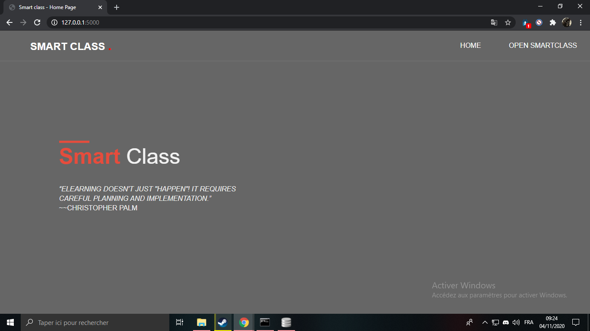
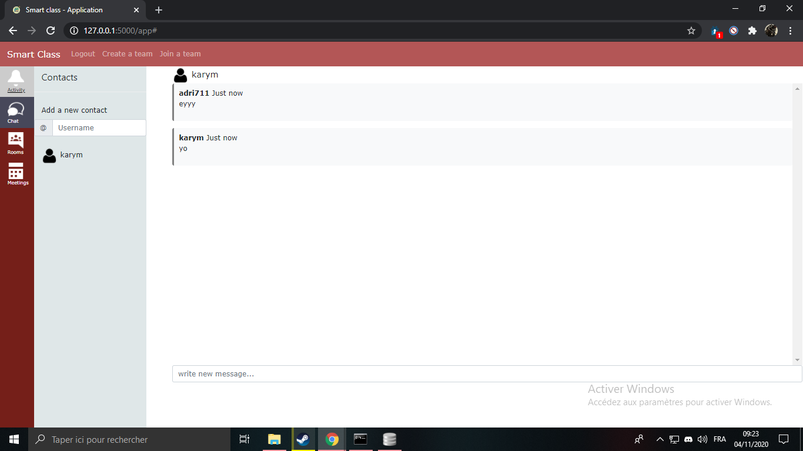
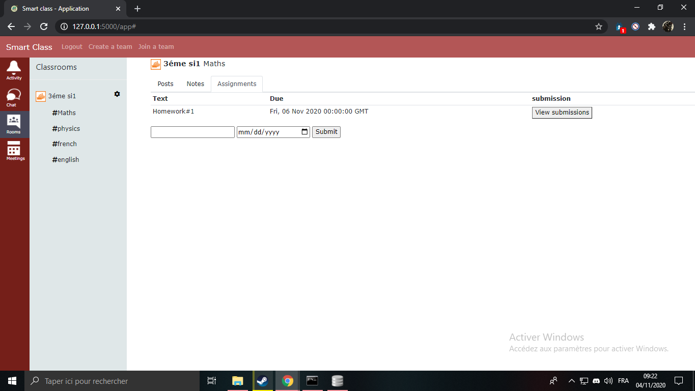
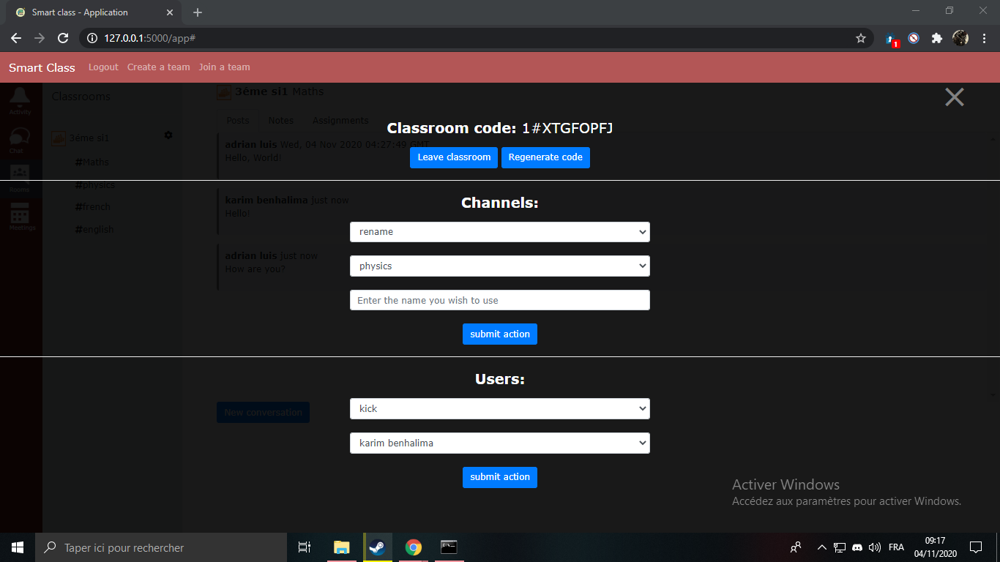

# Classroom Manager
 
## Description
Hey there! This is a website called Classroom Manager. You can create classrooms, have fellow students join the classrooms, chat with your peers, create notes, assign assignments, and more! You can dm 'Top Of Tech#4867' or 'adri711#7835' on discord if you have any thoughts.

Created by [Top Of Tech](http:www.github.com/Top-Of-Tech) and [adri711](http:www.github.com/adri711)

## Instructions

NOTE: Make sure to run all commands in the same directory as the files!

1. Install requirements  
    Run this command in your terminal or command prompt: `pip install -r requirements.txt`

2. Run the website  
    Run this command: `python run.py`
    
3. Go to the website  
    Go to this url: [http://127.0.0.7:5000](http://127.0.0.7:5000)

4. Register

5. Sign in with your email and password

6. Explore the app!

## Screenshots

